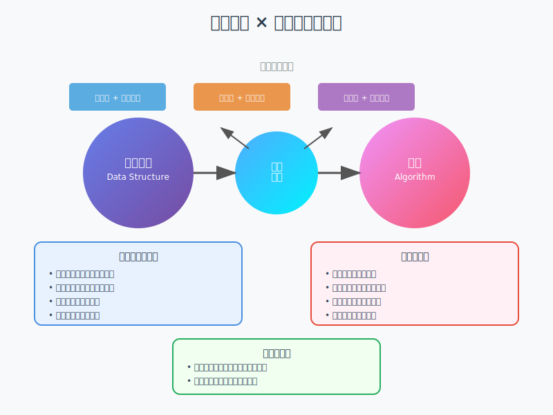

# ✨ 数据结构与算法：理论与实践导引

---

## 🔍 一、什么是数据结构？

> 🧠 数据结构（Data Structure）是将**现实世界问题抽象为计算模型**的核心工具。  
> 它定义了数据的**组织方式**、**存储逻辑**和**操作手段**，是程序设计的骨架。

### 📦 本质理解：
- **数据结构** = 现实事物的信息化建模
- **核心作用**：支撑算法高效运行，确保程序逻辑正确性
- **设计原则**：根据问题特性选择最适合的数据组织形式

### 🧱 常见基础结构：

| 分类       | 典型示例                | 结构特点                    | 核心应用场景                     |
|------------|---------------------|---------------------------|------------------------------|
| **线性结构**   | 数组、链表、栈、队列 | 元素间存在顺序关系，操作简洁 | 缓冲区管理、任务调度、浏览器历史记录 |
| **非线性结构** | 树、图、堆          | 层次化或网状连接关系        | 搜索引擎索引、社交网络、操作系统   |
| **映射结构**   | 哈希表、字典        | 键值对映射，快速检索        | 缓存系统、数据库索引、符号表      |

---

## ⚙️ 二、什么是算法？

> 🧮 算法（Algorithm）是解决特定问题的**有序计算步骤集合**，通过一系列明确、可执行的指令，将输入数据转换为期望的输出结果。

### 💡 设计目标：
- **正确性**（Correctness）：算法能够产生预期的正确结果
- **高效性**（Efficiency）：时间复杂度和空间复杂度尽可能优化
- **可扩展性**（Scalability）：能够处理不同规模的数据集
- **可读性**（Readability）：代码结构清晰，便于理解和维护

### 🧠 经典设计范式：

1. **分治法**：将复杂问题分解为相似的子问题递归求解  
   *典型应用：归并排序、快速排序、二分搜索*

2. **贪心算法**：每步都做出当前最优选择，构建全局解  
   *典型应用：最小生成树（Kruskal）、活动选择问题*

3. **动态规划**：将问题分解为重叠子问题，保存中间结果  
   *典型应用：斐波那契数列、最长公共子序列、背包问题*

4. **回溯算法**：系统性搜索所有可能的解空间  
   *典型应用：N皇后问题、数独求解、图着色*

5. **图算法**：处理图结构数据的专门算法  
   *典型应用：最短路径（Dijkstra）、拓扑排序、强连通分量*

---

## 🔗 三、数据结构 × 算法：相辅相成

数据结构与算法并非孤立存在，而是**紧密耦合、相互依赖**的关系：

### 🎯 核心关系：
- **数据结构**为算法提供**操作平台**和**存储基础**
- **算法**赋予数据结构**实际意义**和**应用价值**
- 选择合适的数据结构能够**显著优化**算法性能
- 精妙的算法设计能够**充分发挥**数据结构的优势

### 🌟 实际应用中的协同：
- **搜索引擎**：使用倒排索引（哈希表+链表）+ 快速排序算法
- **社交网络**：图结构存储关系 + 最短路径算法寻找联系
- **操作系统**：优先队列管理进程 + 调度算法分配资源
- **数据库**：B+树索引结构 + 查询优化算法

---

## 🔍 四、数据结构的基本概念

### 📋 核心术语定义

**数据（Data）**：信息的载体，是客观事物属性的符号表示  
**数据元素（Data Element）**：数据的基本单位，也称为节点或记录  
**数据项（Data Item）**：构成数据元素的不可分割的最小单位  
**数据对象（Data Object）**：性质相同的数据元素的集合

### 🏗️ 数据结构的组成

数据结构由三个部分组成：

1. **逻辑结构**：数据元素之间的逻辑关系
2. **存储结构**：数据在计算机中的存储方式
3. **数据运算**：在逻辑结构上定义的操作集合

### 🎯 数据结构的特性

- **完整性**：包含数据元素、关系和操作的完整定义
- **抽象性**：屏蔽实现细节，提供统一的操作接口
- **封装性**：数据和操作封装在一起，保证数据安全性
- **复用性**：可在不同场景中重复使用

---

## 🔍 五、数据结构的逻辑结构

### 🔄 分类体系

#### 1. 线性结构
数据元素之间存在**一对一**的关系，形成线性序列。

**特点**：
- 有且仅有一个开始节点和一个终端节点
- 除首尾节点外，每个节点都有唯一的前驱和后继

**典型结构**：
- **数组**：连续存储，支持随机访问
- **链表**：指针连接，动态分配内存
- **栈**：后进先出（LIFO），限制访问端
- **队列**：先进先出（FIFO），两端操作

#### 2. 非线性结构
数据元素之间存在**一对多**或**多对多**的关系。

##### 🌳 树形结构
- **特点**：层次化关系，一对多连接
- **应用**：文件系统、组织架构、决策树
- **常见类型**：二叉树、平衡树、B树、红黑树

##### 🕸️ 图形结构
- **特点**：网状关系，多对多连接
- **应用**：交通网络、社交关系、依赖关系
- **分类**：有向图、无向图、加权图

##### 🏔️ 集合结构
- **特点**：元素间无特定关系，仅属于同一集合
- **应用**：并查集、集合运算

---

## 🔍 六、数据结构的存储结构

### 💾 四种基本存储方式

#### 1. 顺序存储结构
数据元素存储在**连续的内存空间**中，通过数组下标访问。

**优点**：
- 支持随机访问，时间复杂度 O(1)
- 空间利用率高，无需额外指针空间
- 简单高效，适合数值计算

**缺点**：
- 插入删除效率低，需要移动大量元素
- 内存分配固定，难以动态调整大小
- 内存要求连续，可能产生内存碎片

**适用场景**：频繁查询、数据量相对固定的场景

#### 2. 链式存储结构
数据元素通过**指针连接**，存储在任意内存位置。

**优点**：
- 动态分配内存，灵活调整大小
- 插入删除高效，时间复杂度 O(1)
- 内存利用灵活，无需连续空间

**缺点**：
- 只支持顺序访问，查找效率低
- 需要额外指针空间，内存开销大
- 访问局部性差，缓存效率低

**适用场景**：频繁插入删除、数据量动态变化的场景

#### 3. 索引存储结构
建立**索引表**加速数据访问，结合顺序和链式存储优点。

**特点**：
- 主数据区存储实际数据
- 索引区存储数据位置信息
- 支持快速定位和高效访问

**应用**：数据库索引、文件系统、搜索引擎

#### 4. 散列存储结构
通过**散列函数**将数据映射到存储位置，实现快速存取。

**优点**：
- 平均查找时间 O(1)
- 插入删除效率高
- 适合大规模数据处理

**挑战**：
- 散列冲突处理
- 散列函数设计
- 负载因子控制

---

## 🔍 七、算法分析

### ⏱️ 时间复杂度分析

时间复杂度描述算法执行时间与输入规模的关系，用**大O记号**表示。

#### 常见时间复杂度等级：

| 复杂度     | 名称       | 性能特点           | 典型算法               |
|------------|------------|-------------------|----------------------|
| O(1)       | 常数时间   | 最优，不随输入变化   | 数组访问、哈希查找      |
| O(log n)   | 对数时间   | 优秀，增长缓慢      | 二分搜索、平衡树操作    |
| O(n)       | 线性时间   | 良好，线性增长      | 数组遍历、链表搜索      |
| O(n log n) | 线性对数   | 可接受，分治算法典型 | 归并排序、快速排序      |
| O(n²)      | 平方时间   | 较差，嵌套循环      | 冒泡排序、选择排序      |
| O(2ⁿ)      | 指数时间   | 极差，组合爆炸      | 旅行商问题、子集枚举    |

#### 📊 分析方法：
1. **最好情况**：算法在最理想输入下的性能
2. **最坏情况**：算法在最不利输入下的性能  
3. **平均情况**：算法在随机输入下的期望性能
4. **摊还分析**：平均分配昂贵操作的成本

### 💾 空间复杂度分析

空间复杂度描述算法执行过程中额外内存消耗与输入规模的关系。

#### 空间消耗来源：
- **输入空间**：存储输入数据所需空间
- **辅助空间**：算法执行过程中的临时空间
- **输出空间**：存储结果数据所需空间

#### 优化策略：
1. **原地算法**：尽量在原数据结构上操作
2. **空间复用**：重复利用临时空间
3. **惰性求值**：按需计算和存储
4. **压缩技术**：减少数据存储空间

### 🎯 算法优化原则

1. **选择合适的数据结构**：根据操作特点选择最适合的结构
2. **减少算法复杂度**：优化核心算法逻辑
3. **利用算法特性**：充分发挥算法内在优势
4. **权衡时空关系**：在时间和空间之间找到平衡
5. **并行化处理**：利用多核处理器提升性能

---

## 🔍 八、总结与展望

### 🎯 核心要点回顾

1. **基础重要性**：数据结构与算法是计算机科学的基石，影响程序的效率和质量
2. **相互依赖性**：数据结构为算法提供基础，算法赋予数据结构意义
3. **实践导向**：理论学习必须结合实际编程练习，在实践中深化理解
4. **持续优化**：随着技术发展，需要不断学习新的数据结构和算法

### 🚀 学习路径建议

#### 🎯 初学者路径：
1. **基础数据结构**：数组、链表、栈、队列
2. **基础算法**：排序、搜索、简单递归
3. **时间空间复杂度**：学会分析算法效率
4. **编程实践**：用多种语言实现基础结构

#### 🔥 进阶路径：
1. **高级数据结构**：树、图、堆、哈希表
2. **算法设计范式**：分治、贪心、动态规划、回溯
3. **实际应用**：解决具体问题，参加编程竞赛
4. **系统设计**：在大型项目中应用所学知识

#### 🎖️ 专家路径：
1. **前沿算法**：机器学习算法、并行算法
2. **算法研究**：阅读论文，关注最新进展
3. **性能优化**：深入系统层面的优化技术
4. **知识分享**：教学、写作、开源贡献

### 🌟 未来发展趋势

1. **并行与分布式算法**：适应多核和云计算环境
2. **机器学习与AI算法**：智能化数据处理方法
3. **量子算法**：探索量子计算的新可能
4. **近似算法**：处理NP难问题的实用方法
5. **内存层次优化**：适应现代计算机体系结构

### 💡 实践建议

1. **理论与实践并重**：深入理解原理，动手编程实现
2. **循序渐进**：从基础数据结构开始，逐步掌握复杂算法
3. **问题导向**：通过解决实际问题来应用所学知识
4. **多语言实践**：在不同编程语言中实现相同的数据结构和算法
5. **持续学习**：关注新技术发展，保持学习热情

---

> 💪 **记住**：数据结构与算法的学习是一个持续的过程，需要在理论学习和实践应用之间找到平衡。只有在不断的编程实践中，才能真正掌握这些核心概念，并在实际项目中游刃有余地应用它们。

---

*📚 继续学习，持续实践，在数据结构与算法的世界中探索更多可能！*